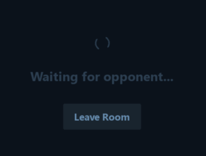
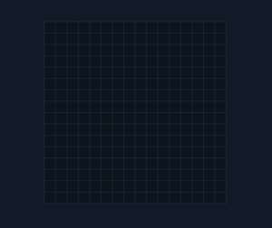

# Gomoku Online

## Pictures

## History
> Gomoku, also called "Five in a Row", is an abstract strategy board game. It is traditionally played with Go pieces (black and white stones) on a Go board. It is played using a 15×15 board while in the past a 19×19 board was standard. Because pieces are typically not moved or removed from the board, gomoku may also be played as a paper-and-pencil game. The game is known in several countries under different names.
*From Wikipedia*

## Rules
> Players alternate turns placing a stone of their color on an empty intersection. Black plays first. The winner is the first player to form an unbroken line of five stones of their color horizontally, vertically, or diagonally. In some rules, this line must be exactly five stones long; six or more stones in a row does not count as a win, and is called an overline. If the board is completely filled and no one can make a line of 5 stones, then it will result in a draw.
*From Wikipedia*

Our game is built a little differently:
1) You can configure almost everything
2) Play online with other people (all you need to do is download the client version)

The programs are in the **bin** directory (just run them)

## License

MIT