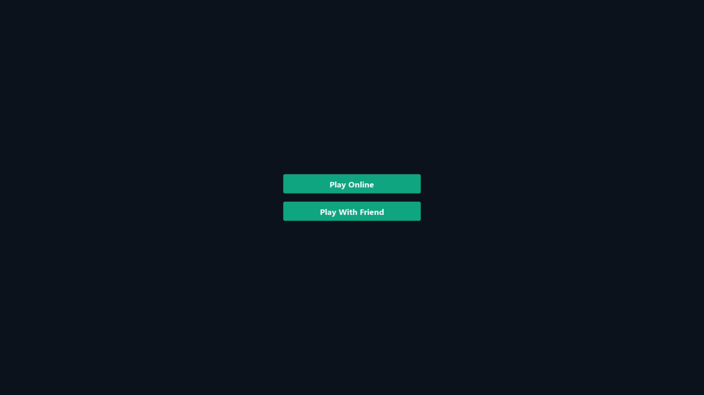
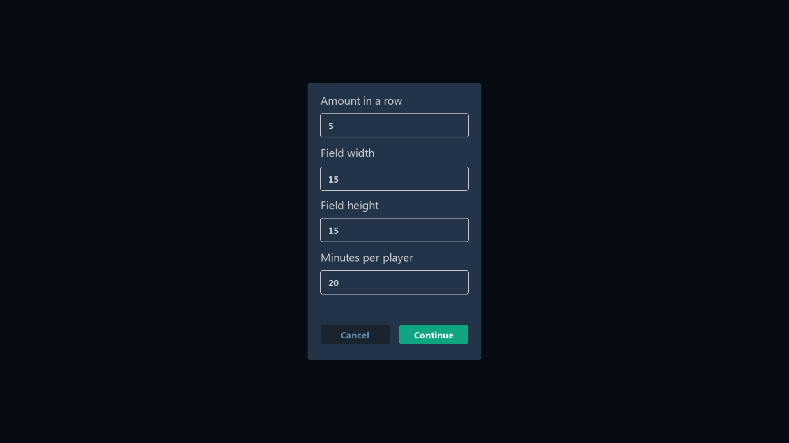
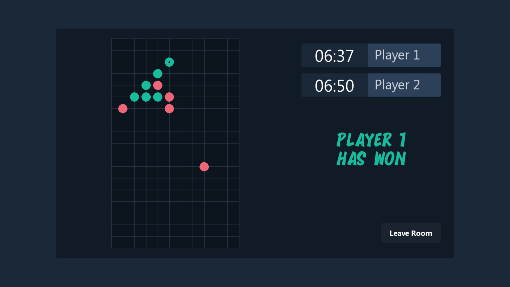
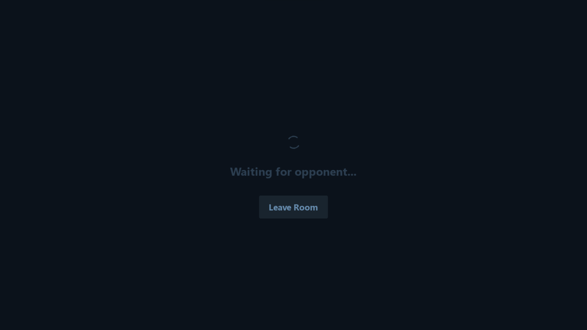

# Gomoku Online/Offline

## Installation
Firstly clone this repository to your computer:
```bash
git clone https://github.com/strangecreator/gomoku
cd gomoku
```
And then, run main.py in **src** folder with --interface parameter *[console, GUI]*:
```bash
python src/main.py --interface=GUI
```

But you can also just run binaries. 
These files are in the **bin** directory.

## Pictures
As the GUI interface started, you can see this window on your screen:

It is a anteroom page.

Further, you can choose a type of field and specify other characteristics of the game:

But, unfortunately, it is possible only in offline mode.

The game itself look like that:

Players take turns placing pieces to win.

If you want to play online, press *Play Online* button and as you can see you are on the waiting page:

After, you will be redirected to the *battle* page to play with somebody via net.

## History
> Gomoku, also called "Five in a Row", is an abstract strategy board game. It is traditionally played with Go pieces (black and white stones) on a Go board. It is played using a 15×15 board while in the past a 19×19 board was standard. Because pieces are typically not moved or removed from the board, gomoku may also be played as a paper-and-pencil game. The game is known in several countries under different names.
*From Wikipedia*

## Rules
> Players alternate turns placing a stone of their color on an empty intersection. Black plays first. The winner is the first player to form an unbroken line of five stones of their color horizontally, vertically, or diagonally. In some rules, this line must be exactly five stones long; six or more stones in a row does not count as a win, and is called an overline. If the board is completely filled and no one can make a line of 5 stones, then it will result in a draw.
*From Wikipedia*

## License

MIT